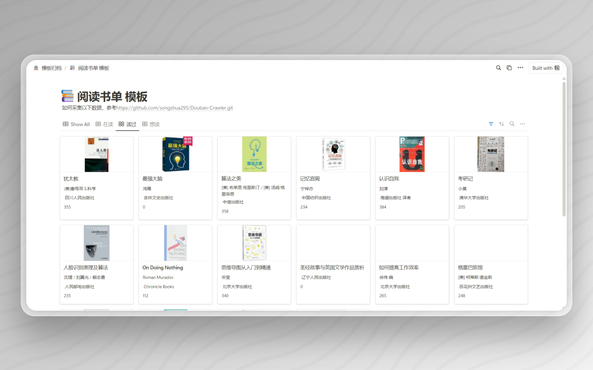
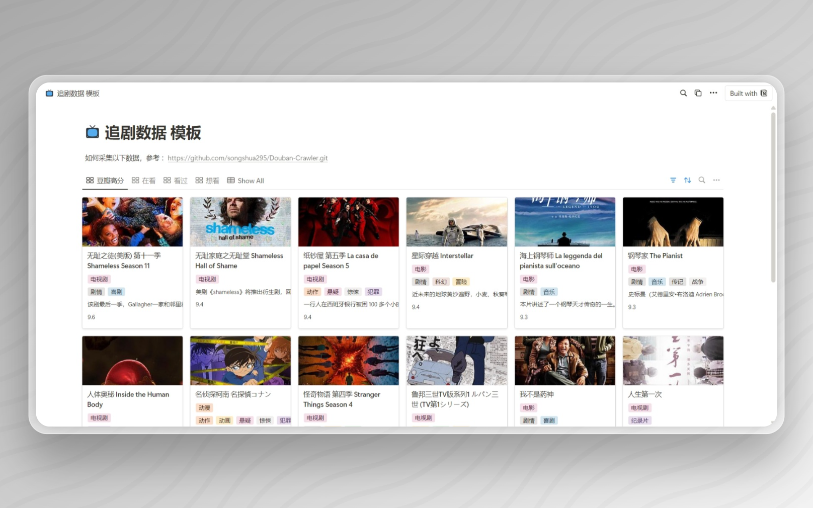
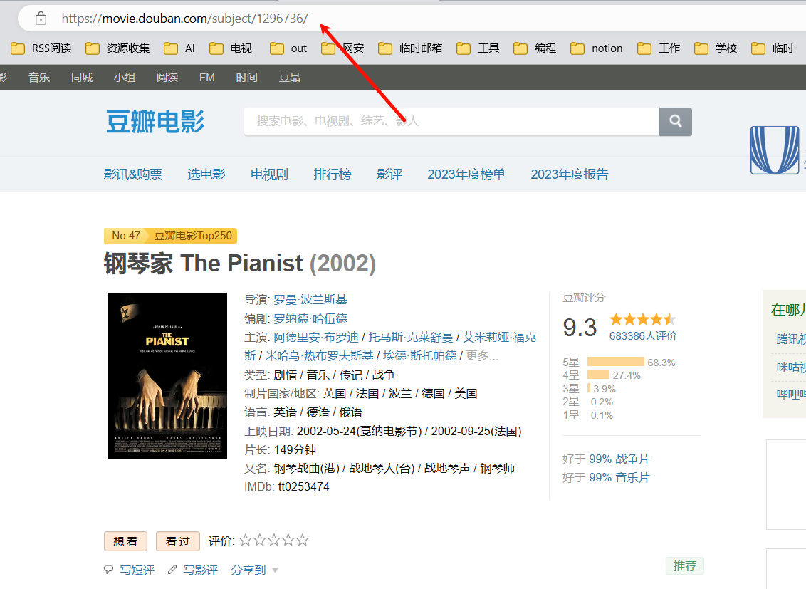

# python爬取豆瓣影视及读书

# 概述

## 场景

> 使用notion记录追剧、看书记录，记录更详细的信息，后续不至于想不起看的啥。
>
> 生成后的直接导入到notion等应用中进行管理即可。

由于书籍以及电影，很多都有重名的，所以还是不得不通过浏览器古老式的方式去找到该页面的url，然后在使用脚本进行信息抓取。

## 效果展示

[阅读书单 模板 | Show All (notion.site)](https://songshua.notion.site/0f2c41c4a52f41e3a68e670fae62a296?v=4f436f06816a43d5be073411aa77f4c0)

[追剧数据 模板 | 豆瓣高分 (notion.site)](https://songshua.notion.site/0c41663e10ff4a5da604753fa16453f4?v=510d034c4fe64feaa85472a13b5735fc)

截图：

​​

​​

​​

# 使用方法

豆瓣电影查询：	[豆瓣电影 (douban.com)](https://movie.douban.com/)

豆瓣读书查询页面：[豆瓣读书 (douban.com)](https://book.douban.com/)

‍

1. 在以上页面中的搜索框中搜索对应的书籍或电影名称，然后复制该电影或者书籍的页面url。url格式如下：

    ```json
    电影url格式：
    https://movie.douban.com/subject/2131940/
    # 豆瓣读书url格式
    https://book.douban.com/subject/3099804/
    ```

    ​​

2. 将url放到对应文件夹中的url.txt中，然后运行对应的脚本即可生成csv文件
3. 将其导入到notion模板中即可。

    1. notion电影模板：[追剧数据 模板 | 豆瓣高分 (notion.site)](https://songshua.notion.site/0c41663e10ff4a5da604753fa16453f4?v=510d034c4fe64feaa85472a13b5735fc)
    2. notion阅读模板：[阅读书单 模板 | Show All (notion.site)](https://songshua.notion.site/0f2c41c4a52f41e3a68e670fae62a296?v=4f436f06816a43d5be073411aa77f4c0)

‍

---

# Notion中的字段修改（可不选）

**推荐使用我的模板，进行导入。**

如果你没有使用我的模板进行导入，推荐在导入csv到 notion 中后 添加如下字段。

视图「view」方面，可以自行进行定义，常见的有：在看、想看、已看等

## 影视库Notion字段更改

「海报图片」：类型修改为`Files & media`​，会自动变为图片；

「导演」、「主演」、「标签」、「类型」：类型修改为`Multi-select`​，会自动变为多选标签

## 书籍库Notion字段更改

「封面」：类型修改为`Files & media`​，会自动变为图片；

「状态」：添加该字段，类型为`status`​，值为 已读、在读、想读、归档；

「类别」：添加该字段，由于豆瓣采集中没有该字段，所以无法获取，只能自己进行打标签。常见标签如小说、传记、悬疑等，更多可参考：[豆瓣图书标签 (douban.com)](https://book.douban.com/tag/)；

「日期」：主要记录开始时间与完成时间；

「评分」：自己的评分，数字或者星⭐表示都可以

更多可选字段：

「进度」：记录当前的已读页数表示进度。

‍
